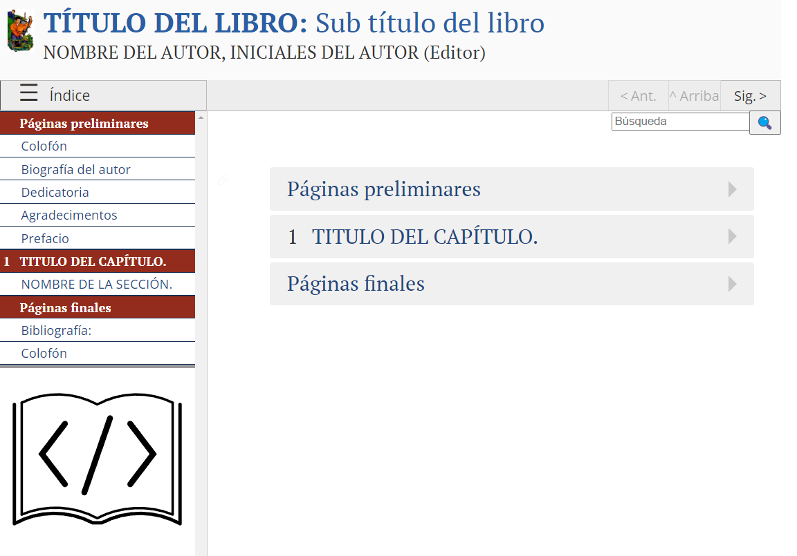

### 📚 **Proyecto Genérico para PreTeXt-CLI 🚀✨**

Esta es una propuesta y ejemplo base con los requerimientos necesarios para editar un libro, publicación o algún documento genérico, con [**PreTeXt**](https://pretextbook.org/). Usando [**Codespace de GitHub**](https://docs.github.com/en/codespaces) y asociándolo a este repositorio, permite tener en la nube de GitHub todo lo necesario para la edición y publicación en diversos formatos: **LaTeX**, **PDF**, **HTML**, **EPUB**, **Jupyter Notebook**, **Braille**, entre otros.

👉 **Ejemplo en producción:** [Libro Web](https://rommeljose.github.io/proyectos_genericos_pretext/titulo-libro.html)

<a href="https://rommeljose.github.io/proyectos_genericos_pretext/titulo-libro.html">
    
</a>


## 🚀 **¿Qué es PreTeXt?**

[**PreTeXt**](https://pretextbook.org/) es un lenguaje de marcado semántico que permite estructurar documentos académicos y técnicos de manera lógica. Captura la estructura de libros de texto y trabajos de investigación y facilita su conversión a múltiples formatos.

- **Formato de archivo:** `.ptx` o `.xml`.
- **Editor recomendado:** [**Visual Studio Code**](https://code.visualstudio.com/) con complementos para PreTeXt.

---

## 🛠️ **Instalación de PreTeXt en Ubuntu o Codespaces**

### 1️⃣ **Entorno Virtual Python (opcional pero recomendado)**

```bash
python -m venv editorial
source ./editorial/bin/activate
```

> ⚠️ **Verifique si tiene Python instalado:**  
> `$ python --version` o `$ python3 --version`

---

### 2️⃣ **Instalar PreTeXt-CLI**

```bash
pip install pretext
```

---

### 3️⃣ **Configuración Adicional (Opcional)**

Modifique para castellanizar el resultado PDF y WEB.

Desde la raíz del repositorio:

```bash
cp ./.es-Es/es-ES.xml ~/.ptx/2.10.1/core/xsl/localizations/
```

---

## ⚙️ **Ajustes Opcionales para personalizar los Iconos en la parte inferior de la página Web**

Puedes personalizar los logos modificando la plantilla `pretext-html` en la instalación local `~\.ptx\2.10.1\core\xsl`:

```xml
<xsl:template name="mathjax-link">
    <a class="mathjax-link" href="https://www.mathjax.org" title="MathJax">
        
    </a>
</xsl:template>
```

```xml
<xsl:template name="runestone-link">
    <a class="runestone-link" href="https://runestone.academy" title="Runestone Academy">
        
    </a>
</xsl:template>
```

---

## 📂 **Estructura del Proyecto**

```plaintext
📦 libro-pretext-generico
.
├── .devcontainer.json
├── .git
├── .github
├── .gitignore
├── .vscode
├── README.md
├── project.ptx
├── requirements.txt
├── codechat_config.yaml
├── assets
├── output
├── publication
└── source
```

---

## 📝 **Comandos Básicos de PreTeXt**

### ➡️ **Construir el libro en formato HTML:**
```bash
pretext build web
```

### ➡️ **Ver el libro en el navegador:**
```bash
pretext view web
```

### ➡️ **Desplegar en GitHub Pages:**
```bash
pretext deploy
```

---

## 📊 **Dependencias Adicionales para LaTeX**

### Instalar Paquetes Básicos:
```bash
sudo apt-get install texlive-latex-base
sudo apt-get install texlive-fonts-recommended
sudo apt-get install texlive-fonts-extra
sudo apt-get install texlive-science
sudo apt-get install texlive-latex-extra
```

### Recursos Útiles:
- [**How To Install "texlive-latex-base" Package on Ubuntu**](https://zoomadmin.com/HowToInstall/UbuntuPackage/texlive-latex-base)  
- [**LaTeX: instalación TeXLive + Texmaker (Ubuntu)**](https://mecatronicauaslp.wordpress.com/2013/07/25/latex-instalacion-texlive-texmaker-ubuntu/)

---

## 📚 **Principios de PreTeXt**

- Legible y escribible por humanos.  
- Compatible con múltiples formatos.  
- Respetuoso de las buenas prácticas editoriales.  
- Gratuito y de código abierto.  
- Enfocado en la accesibilidad y la experiencia del usuario.  
- Capacidad de exportación a formatos como LaTeX, HTML, PDF, EPUB, entre otros.

---

## 🎓 **Documentación Oficial**

- [Documentación de PreTeXt](https://pretextbook.org/doc/guide/html/index.html)
- [Repositorio de PreTeXt en GitHub](https://github.com/PreTeXtBook)

---

## 🤝 **Contribuciones**

¡Las contribuciones son bienvenidas! Puedes abrir un **issue** o enviar un **pull request**.

---

## 📝 **Licencia**

Este proyecto está bajo la licencia **MIT**. Consulta el archivo `LICENSE` para más detalles.

---

## 🚀 **¡Únete a la Comunidad PreTeXt!**

- [Foro de PreTeXt](https://groups.google.com/forum/#!forum/pretext-support)
- [Chat en Zulip](https://pretext.zulipchat.com/)

---

